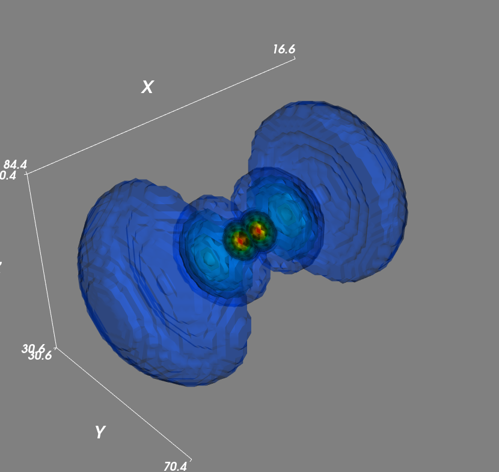
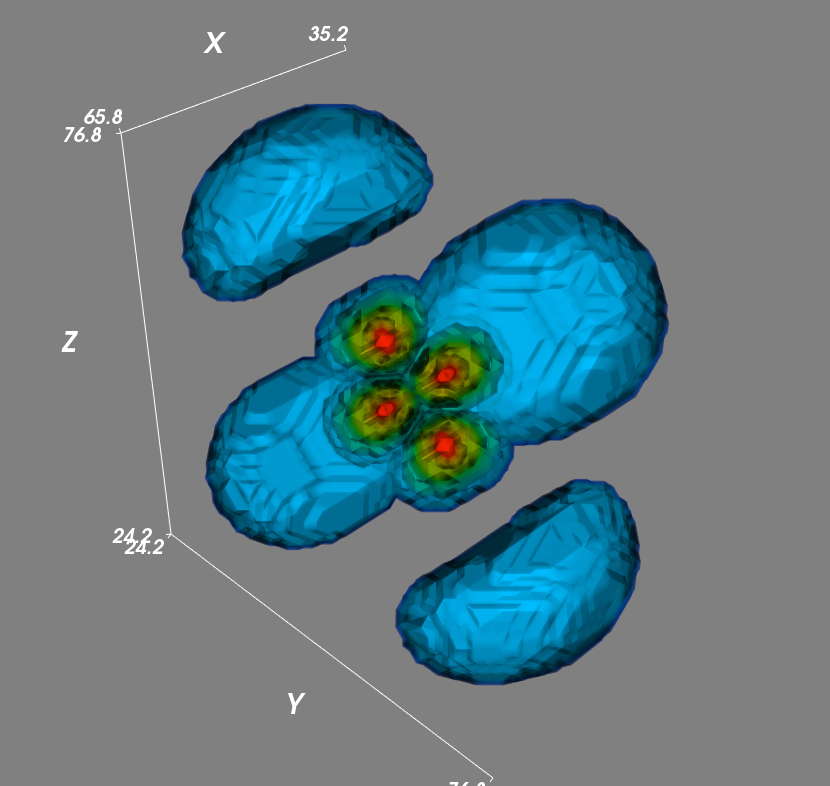
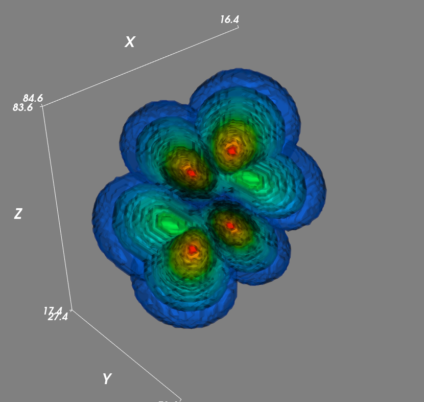

# Schrodinger Equation

## Dependencies

```
python3 --version

>>> 3.5.0 and above
```

```
pip3 install --upgrade numpy
pip3 install --upgrade scipy
pip3 install --upgrade mayavi
pip3 install --upgrade PyQt5
```

## Orbital Visualisation
> **n**: Principal Quantum Number
>
> **l**: Angular Momentum Quantum Number
>
> **m**: Magnetic Quantum Number

| n | l | m | Orbital | 3D View | Section View |
| :---: | :---: | :---: | :---: | :---: | :---: |
| 1 | 0 | 0 | 1s |  |  |
| 2 | 0 | 0 | 2s |  |  |
| 2 | 1 | 1 | 2p<sub>x</sub> |  |  |
| 2 | 1 | 0 | 2p<sub>z</sub> |  |  |
| 2 | 1 | -1 | 2p<sub>y</sub> |  |  |
| 3 | 0 | 0 | 3s |  |  |
| 3 | 1 | 1 | 3p<sub>x</sub> |  |  |
| 3 | 1 | 0 | 3p<sub>z</sub> |  |  |
| 3 | 1 | -1 | 3p<sub>y</sub> |  |  |
| 3 | 2 | 2 | 3d<sub>x<sup>2</sup>-y<sup>2</sup></sub> |  |  |
| 3 | 2 | 1 | 3d<sub>yz</sub> |  |  |
| 3 | 2 | 0 | 3d<sub>z<sup>2</sup></sub> |  |  |
| 3 | 2 | -1 | 3d<sub>xz</sub> |  |  |
| 3 | 2 | -2 | 3d<sub>xy</sub> |  |  |
| 4 | 0 | 0 | 4s |  |  |
| 4 | 1 | 1 | 4p<sub>x</sub> |  |  |
| 4 | 1 | 0 | 4p<sub>z</sub> |  |  |
| 4 | 1 | -1 | 4p<sub>y</sub> |  |  |
| 4 | 2 | 2 | 4d<sub>x<sup>2</sup>-y<sup>2</sup></sub> |  |  |
| 4 | 2 | 1 | 4d<sub>yz</sub> |  |  |
| 4 | 2 | 0 | 4d<sub>z<sup>2</sup></sub> |  |  |
| 4 | 2 | -1 | 4d<sub>xz</sub> |  |  |
| 4 | 2 | -2 | 4d<sub>xy</sub> |  |  |
| 4 | 3 | 3 | 4f<sub>y(3x<sup>2</sup>-y<sup>2</sup>)</sub> |  |  |
| 4 | 3 | 2 | 4f<sub>z(x<sup>2</sup>-y<sup>2</sup>)</sub> |  |  |
| 4 | 3 | 1 | 4f<sub>yz<sup>2</sup></sub> |  |  |
| 4 | 3 | 0 | 4f<sub>z<sup>3</sup></sub> |  |  |
| 4 | 3 | -1 | 4f<sub>xz<sup>2</sup></sub> |  |  |
| 4 | 3 | -2 | 4f<sub>xyz</sub> |  |  |
| 4 | 3 | -3 | 4f<sub>x(x<sup>2</sup>-3y<sup>2</sup>)</sub> |  |  |

`Created by Huang He (Mark) | 15 MAR 2020`
